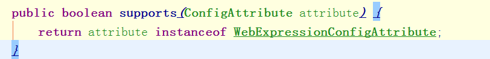

# spring boot 自动配置类
>spring-autoconfigure-metadata.properties

>1.可以找到和security相关的自动配置类
>SecurityAutoConfiguration   UserDetailsServiceAutoConfiguration

- 过滤器链子
- 0 = {WebAsyncManagerIntegrationFilter@5495}
- 1 = {SecurityContextPersistenceFilter@5494}
- 2 = {HeaderWriterFilter@5493}
- 3 = {CsrfFilter@5492}
- 4 = {LogoutFilter@5491}
- 5 = {UsernamePasswordAuthenticationFilter@5487}
- 6 = {DefaultLoginPageGeneratingFilter@5539}
- 7 = {DefaultLogoutPageGeneratingFilter@5540}
- 8 = {RequestCacheAwareFilter@5541}
- 9 = {SecurityContextHolderAwareRequestFilter@5542}
- 10 = {AnonymousAuthenticationFilter@5543}
- 11 = {SessionManagementFilter@5544}
- 12 = {ExceptionTranslationFilter@5545}
- 13 = {FilterSecurityInterceptor@5546}
-      0 = {WebExpressionVoter@5600}
-         expressionHandler = {DefaultWebSecurityExpressionHandler@5607}

# 问题
- 1.登陆发现得3秒左右
-     new BCryptPasswordEncoder(14);发现是加密次数设置过多，使用默认值即可发现登陆变成了400ms左右
- 2.点击/login, 多次到登陆界面
-     DefaultLoginPageGeneratingFilter 设计的问题（就像请求一个连接一样，多次请求，当然就返回多个结果）
- 3.发现sesion并发控制设置为1 不起效
-     1.自己测试错误（登陆两边后，同时刷新一个会无效）
- 4.为什么 ConcurrentSessionControlAuthenticationStrategy 里的sessionCount 会为2 不会为3（allowedSessions 为1）
-       int sessionCount = sessions.size();
		int allowedSessions = getMaximumSessionsForThisUser(authentication);
		因为当为1时和allowedSessions是相等的，因此要判断是否是当前机器登陆如果是 sessionCount会变为2
		会执行allowableSessionsExceeded(session超过1后执行清理动作) 清空过期的session
- 5.使用roles 增加角色权限无效 
>new WebExpressionVoter() 不支持
  我们自定义添加的url和权限映射（类不一样）  
  
